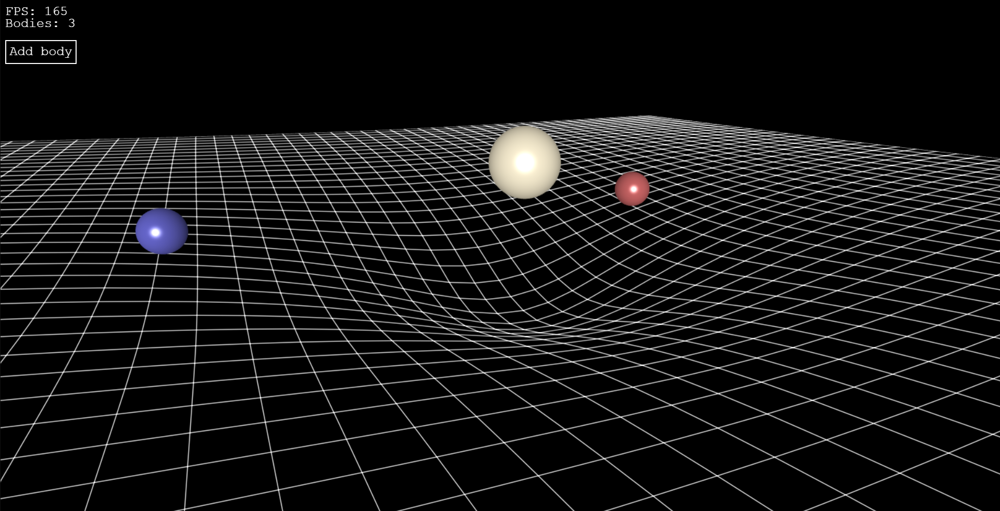

Simple interactive 3D gravity simulation made with BabylonJS  
  
Controls:
- Movement: WASD
- Scale body: Mouse scroll
- Reposition body: Mouse drag
  

Demo: https://jeff-160.github.io/Gravity-Simulation/
